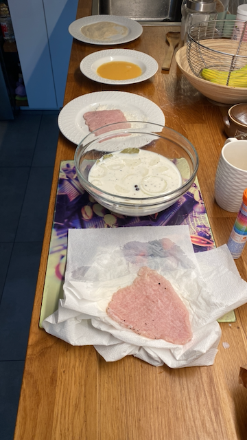
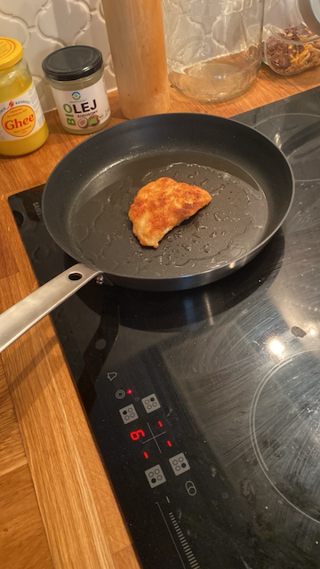

# Kotlet schabowy

## Składniki

* 600 g schabu środkowego
* 500 ml mleka
* 2 ząbki czosnku
* 1 cebula
* 3 liście laurowe
* 3 ziarna ziela angielskiego
* 1,5 łyżeczki soli
* 0,5 łyżeczki pieprzu czarnego
* 1 szklanka mąki pszennej
* 1 szklanka bułki tartej
* olej roślinny lub np. smalec do smażenia

## Wykonanie

* Mięso podziel na cztery równe kotlety. Rozklep tłuczkiem do mięsa przez folię
  spożywczą. Grubość zależy o indywidualnych preferencji, osobiście nie rozbijam
  kotletów zbyt cienko, lubię gdy mają około 0,5 cm.
* Tak przygotowane mięso przełóż do miski z mlekiem, dodaj obrany rozgnieciony
  czosnek, cebule pokrojoną w plastry, liść laurowy, ziele angielskie oraz sól i
  pieprz.
* Odstaw do lodówki na 3-4 godziny, najlepiej na całą noc. Po tym czasie kotlety
  osusz ręcznikiem papierowym.
* Następnie panieruj klasycznie: mąka, rozmącone jajo i bułka tarta.

    

* Smaż na oleju lub smalcu na średnim ogniu po 3-4 minuty z każdej. Przed
  podaniem osącz z nadmiaru tłuszczu na ręczniku papierowym. Podawaj z ulubionymi
  dodatkami, u mnie ziemniaki z koperkiem i mizerią.

    

## Referencje

1. [Kuroń J., Perfekcyjny kotlet schabowy, kuron.com.pl](https://kuron.com.pl/artykuly/przepisy/dania-glowne/perfekcyjny-kotlet-schabowy/)