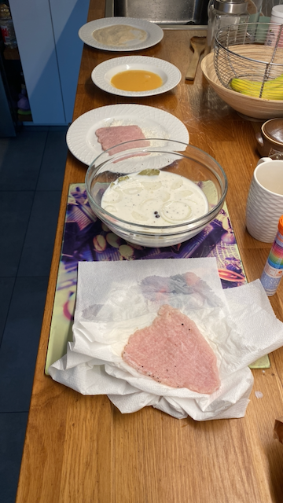
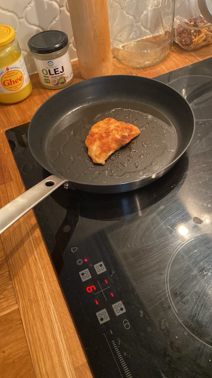

# Kotlet schabowy

## Składniki

* Schab środkowy - 600 g
* Mleko - 500 ml
* Czosnek - 2 ząbki
* Cebula - 1 szt.
* Liście laurowe - 3 szt.
* Ziele angielskiego - 3 ziarna
* Sól - 1,5 łyżeczki
* Pieprz czarny - 1/2 łyżeczki
* Mąka pszenna - 1 szklanka
* Bułka tarta - 1 szklanka
* Smalec do smażenia

## Przygotowanie

1. Mięso podziel na cztery równe kotlety. Rozklep tłuczkiem do mięsa przez folię
   spożywczą. Grubość zależy o indywidualnych preferencji, osobiście nie rozbijam
   kotletów zbyt cienko, lubię gdy mają około 0,5 cm.
2. Tak przygotowane mięso przełóż do miski z mlekiem, dodaj obrany rozgnieciony
   czosnek, cebule pokrojoną w plastry, liść laurowy, ziele angielskie oraz sól i
   pieprz.
3. Odstaw do lodówki na 3-4 godziny, najlepiej na całą noc. Po tym czasie kotlety
   osusz ręcznikiem papierowym.
4. Następnie panieruj klasycznie: mąka, rozmącone jajo i bułka tarta.

    

5. Smaż na rozgrzanym smalcu na średnim ogniu po 3-4 minuty z każdej. Przed
   podaniem odsącz z nadmiaru tłuszczu na ręczniku papierowym. Podawaj z ulubionymi
   dodatkami, u mnie ziemniaki z koperkiem i mizerią.

    

## Uwagi

1. [Kuroń J., Perfekcyjny kotlet schabowy, kuron.com.pl](https://kuron.com.pl/artykuly/przepisy/dania-glowne/perfekcyjny-kotlet-schabowy/)
