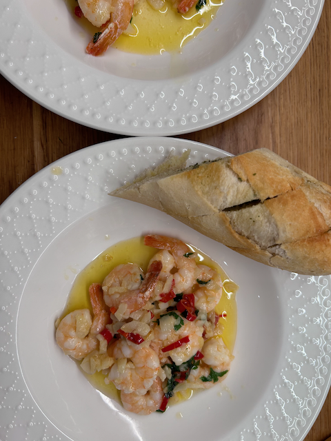
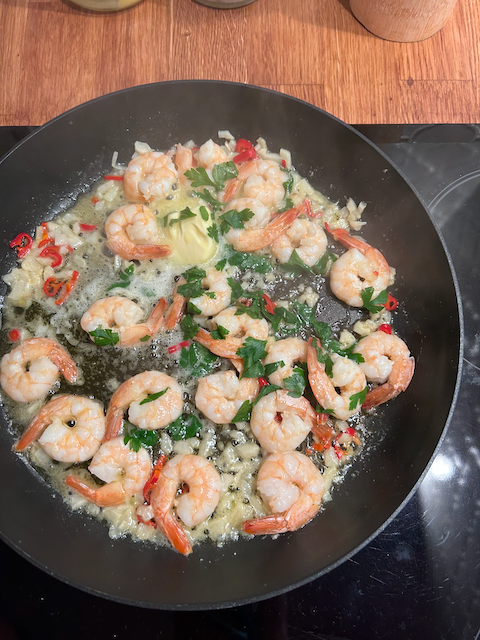

# Krewetki z patelni z czosnkiem, natką i chili

Krewetki smażone na maśle z czosnkiem, natką i papryczką chili. Podlewane
białym winem, podawane z bagietką. Najlepszy i najprostszy sposób na krewetki!

## Składniki

* Krewetki (surowe lub gotowane, mrożone lub świeże) - 250 g (ok. 20 sztuk)
* Czosnek - 4 ząbki (drobno posiekane)
* Masło - 40 g
* Białe wino - 50 ml lub sok z cytryny - 2 łyżki
* Oliwa extra vergine - 3 łyżki
* Sól do smaku
* Listki z 2 gałązek natki pietruszki
* Papryczka chili - 1/2 sztuki (drobno posiekana)

## Przygotowanie

1. Mrożone krewetki włożyć do miski, wlać letnią wodę i rozmrozić. Nieobrane
   krewetki obrać z pancerzy (pozostawić ogonki). Nieoczyszczone krewetki
   naciąć lekko nożem wzdłuż tułowia i usunąć czarne jelito. Tak przygotowane
   krewetki opłukać i dokładnie osuszyć.
2. Na patelni podgrzać połowę masła, włożyć drobno posiekany czosnek (i chili
   jeśli używamy) i smażyć przez pół minuty. Włożyć krewetki i smażyć przez
   minutę z jednej strony.
3. Wlać wino i na większym ogniu odparować, lub dodać sok z cytryny. Zmniejszyć
   ogień do średniego, krewetki przewrócić na drugą stronę i smażyć przez
   kolejną minutę.
4. Przewrócić krewetki rozcięciem do dołu i smażyć jeszcze przez pół minuty. Na
   koniec dodać posiekaną natkę pietruszki, resztę masła i oliwę extra vergine.
   Roztopić masło i odstawić z ognia. Doprawić cytryną, solą i podawać z
   kawałkami bagietki.

    

## Uwagi

* [Krewetki z patelni z czosnkiem, natką i chili, Kwestia Smaku](https://www.kwestiasmaku.com/ryby_i_owoce_morza/krewetki/krewetki_z_patelni/przepis.html)
