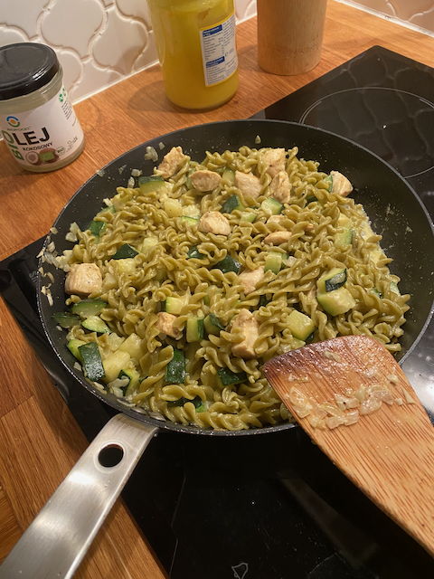

# Makaron z cukinią i kurczakiem w sosie curry

Prosty i pyszny makaron z cukinią i kurczakiem w śmietankowym sosie curry.

## Składniki

* Makaron np. kokardki - 125 g
* Pierś kurczaka - 1 sztuka
* Przyprawy curry w proszku - 1/2 łyżeczki
* Oliwa - 1 łyżka
* Czosnek - 2 ząbki
* Cebula - 1 sztuka
* Masło - 1/2 łyżki
* Cukinia - 1 nieduża sztuka (ok. 270 g)
* Śmietana 30% - 80 ml
* Bazylia

## Przygotowanie

1. Nastawić osoloną wodę na makaron i ugotować go *al dente*.
2. Filet z kurczaka pokroić w małą kostkę. Doprawić solą, pieprzem i przyprawą
   curry, następnie wymieszać z 1 łyżeczką oliwy i połową przeciśniętego przez
   praskę czosnku.
3. Na patelni na reszcie oliwy i maśle zeszklić pokrojoną w kosteczkę cebulę
   (ok. 5 minut co chwilę mieszając), pod koniec dodać resztę czosnku.
4. Dodać pokrojoną w kosteczkę cukinię, doprawić solą i pieprzem i co chwilę
   mieszając smażyć przez ok. 5 minut, aż cukinia zmięknie i miejscami się
   zrumieni.
5. Wówczas dodać pokrojonego kurczaka i mieszając obsmażyć go przez ok. 3 minuty.
6. Dodać śmietankę, wymieszać i zagotować. Dodać ugotowany makaron, wymieszać i
   podgrzać. Posypać posiekaną bazylią i podawać.

    

## Uwagi

* [Makaron z cukinią i kurczakiem w sosie curry, Kwestia Smaku](https://www.kwestiasmaku.com/przepis/makaron-z-cukinia-i-kurczakiem-w-sosie-curry)
