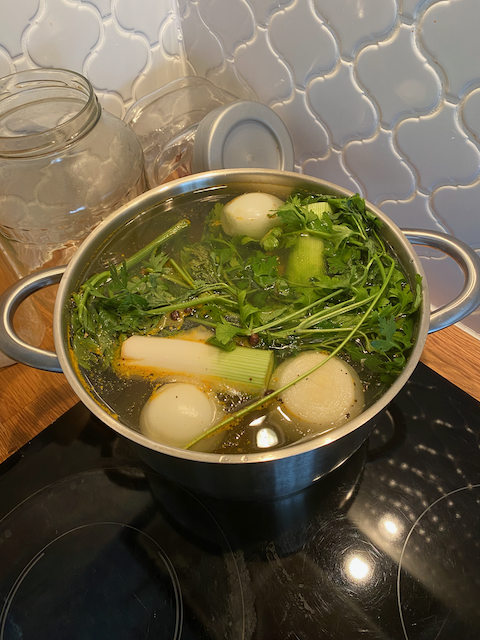

# Rosół niedzielny

## Składniki

* 5-6 litrow zimnej wody
* 6 marchewek
* 2-3 pietruszki
* 0,5 pora
* 0,5 selera
* 3 cebule (mogą być w łupinie)
* duża garść natki pietruszki, liści selera i lubczyku (poza sezonem użyj
  zielone kostki rosolowe - lub dodaj po łyżeczce suszonych)
* 1 zabek czosnku
* 8 ziaren ziela angielskiego
* 4 liscie laurowe
* 1 łyżeczka kurkumy
* 1 łyżka soli kamiennej klodawskiej
* kawałek imbiru (1-2 cm)
* szczypta świeżo mielonego pieprzu lub kilka jego ziaren
* ok. 1 kg mięsa z kurczaka (nailepiej użyć całego kurczaka, podzielonego na
  porcje, ale zdarza mi sie także używać porcii rosołowej); jeśli wolisz
  mocniejszy smak - dodaj kawalek wołowiny, gęsi, indyka, perlicy, królika

## Przygotowanie

1. Do dużego garnka włóż umyte i podzielone mięso, obrane i prekrojone na pół
   warzywa.
2. Zalej zimną wodą.
3. Dodaj przyprawy.
4. Teraz możesz włączyć kuchnię.
5. Po zagotowaniu zmniejsz ogień i gotuj rosół przez ok. 2-3 godziny (zupa
   powinna "pyrkać" na małym ogniu).

    

## Uwagi

Nastawiając rosół pamietaj, że **mięso i warzywa zalewamy zawsze zimną wodą**.
To ważne, bo w przypadku rosołu zależy nam, aby wszystkie wartości odżywcze
przeszły do wywaru i nie zostały "zamknięte" w warzywach.

Jeśli po zagotowaniu rosołu zmniejszysz moc kuchni i będzie "pyrkał" na małym ogniu,
**nie bedzie potrzeby szumowania**. Z doświadczenia mogę powiedzieć ponadto, że
rosół nastawiony na dobrej jakości kurze na pewno szumowania nie wymaga. Dodatek
wołowiny może nasilić wytrącanie się szumowin. Jednak moje obserwacje są takie,
że przy trzygodzinnym "pyrkaniu" wywar ładnie się klaruje.

Nastawiając rosół na drobiu, 2-3 godziny gotowania będą wystarczające.
Natomiast wołowina potrzebuje więcej czasu, nawet 5 godzin "pyrkania".
