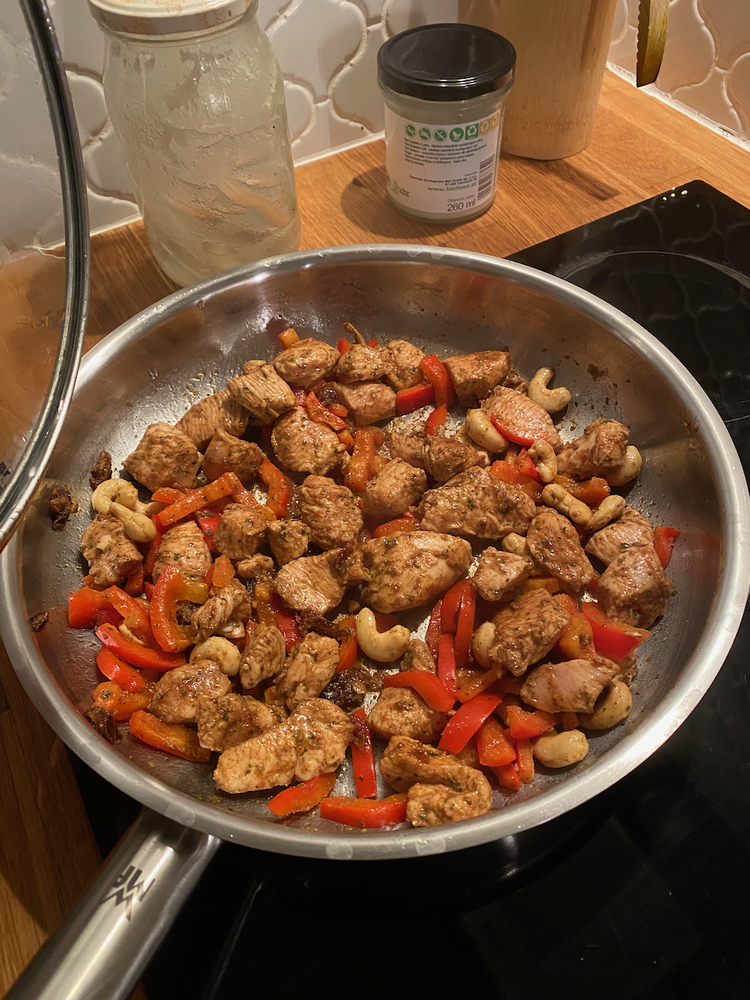

# Tajski Obiad (wg Borysa Mańkowskiego)

## Składniki

* Pierś z kurczaka - ok 200g
* Oliwa z oliwek - 3 łyżki stołowe
* Sól - 1/2 łyżeczki
* Cynamon - 1/2 łyżeczki
* Kolendra świeża lub mielona - 1/2 łyżeczki przyprawy
* Chili pieprz cayenne mielone lub papryka słodka mielona lub papryka ostra mielona - 1/2 łyżeczki
* Papryka czerwona - 1 szt.
* Daktyle suszone - 4 szt.
* Orzechy nerkowca - garść
* Sos sojowy - 2 łyżki stołowe

## Przygotowanie

1. Pokroić kurczaka na drobne kawałki i wrzucić do miseczki. Dodać 3 łyżki
   oliwy z oliwek i przyprawy. Dodać paprykę pokrojoną na małe paseczki. Dodać
   drobno pokrojone daktyle i wszystko dokładnie wymieszać. Odstawić mięso do
   marynowania jeśli mamy czas.
2. Rozgrzać patelnię, wrzućić orzechy nerkowca i prażyć przez kilka minut.
3. Wrzucić mięso w marynacie na patelnię. Smażyć pod pokrywką 2-3 minuty. Potem
   dokładnie wymieszać i smażyć pod pokrywką kolejne 3 minuty.
4. Dodać sos sojowy i smażyć około 1 minuty. Wyłączyć kuchenkę i zostawić mięso
   pod pokrywką, żeby "złapało" aromatu

## Uwagi

* <https://www.youtube.com/watch?v=FdwsdioMdIw&t=712s>

